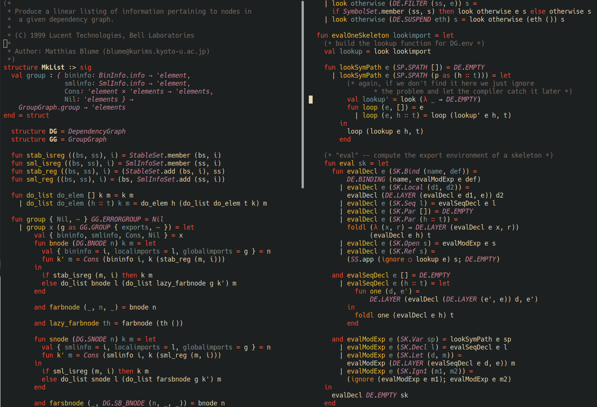

# SML major mode using tree-sitter

[](https://www.gnu.org/licenses/gpl-3.0)

This mode provides the typical tree-sitter goodies for SML buffers:

- indentation
- font-locking
- imenu
- structural navigation



## Installing

Emacs 29.1 or above with tree-sitter support is required. 

This package is uses the tree-sitter grammar for SML found from
https://github.com/MatthewFluet/tree-sitter-sml.  _It won't work with other parsers!_

### Install tree-sitter parser for SML

Add the source to `treesit-language-source-alist`. 

```elisp
(add-to-list
 'treesit-language-source-alist
 '(sml "https://github.com/MatthewFluet/tree-sitter-sml"))
```

Then run `M-x treesit-install-language-grammar` and select `sml` to install.
